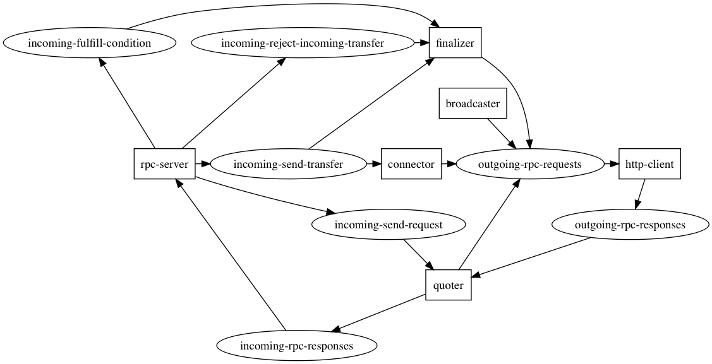

# The Metamorphosis

## Current Architecture

## Roadmap

### Back end

- [x] Combine RPC Server and Authorizer
- [ ] Add rejector (passes back error messages)
- [ ] Add fixer.io + coinmarketcap for exchange rates (and tag ledgers with currency codes)
- [ ] Implement route broadcaster for CCP
- [ ] Dynamic routing table (Kafka? Zookeeper? Redis?)
- [ ] Implement route receiver for CCP
- [ ] Dynamic user and peer registration (probably need KV store)
- [ ] Add support for multiple ledger plugins
- [ ] Add balance checker (internal ledger)
- [ ] Add transfer expirer (produces to rejector's topic)
- [ ] Check transfer state through RPC (get fulfillment)
- [ ] Admin SPSP fulfiller (listens on send transfer topic)

### Front end

- [ ] Make butterfly prettier
- [ ] CLI for adding users
- [ ] CLI for configuring routes (?)
- [ ] UI for user registration
- [ ] UI for user API key management
- [ ] UI for viewing trustline balances
- [ ] Metrics
- [ ] Transaction history
- [ ] Metrics for Cicada

### Open Questions

* Should there be a standard API for non-payment related functions (e.g. realtime activity feeds, transaction history, API token management, etc)?
* Should the routing table contain rate information as well or should that be separate?
* What kind of (Key Value?) store do we need aside from Kafka? (for routing tables, users and peers, etc)
* What serialization format should the components use between one another? (Right now it uses JSON)
* Is Kafka the best stream technology to use?
* How micro should the microservices be?
* Should configuration be with files or UI?
